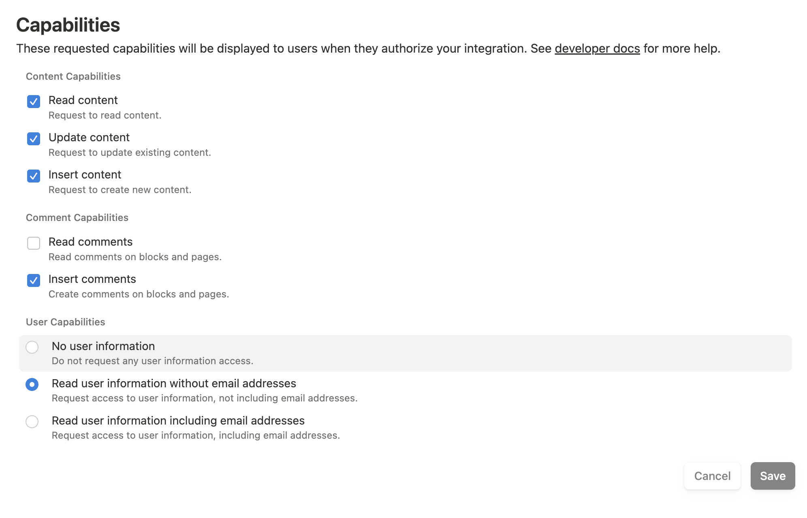

# poc-kube-homelab-notion-notifications-argo-config

This PoC is for the Argo config to create a Sample CronJob to write records to a Notion Database to then trigger notifications.

## Notion Integration

A Notion Integration is needed for this to work and an Internal integration can be created for your workspace at https://www.notion.so/profile/integrations

The following capabilities are required:

Once done, setup the secrets required for the project to work. More details in the notion-secrets.yaml

Then create the CronJob. I'm using Argo CD to create it, but you can manually apply the manifest too.
